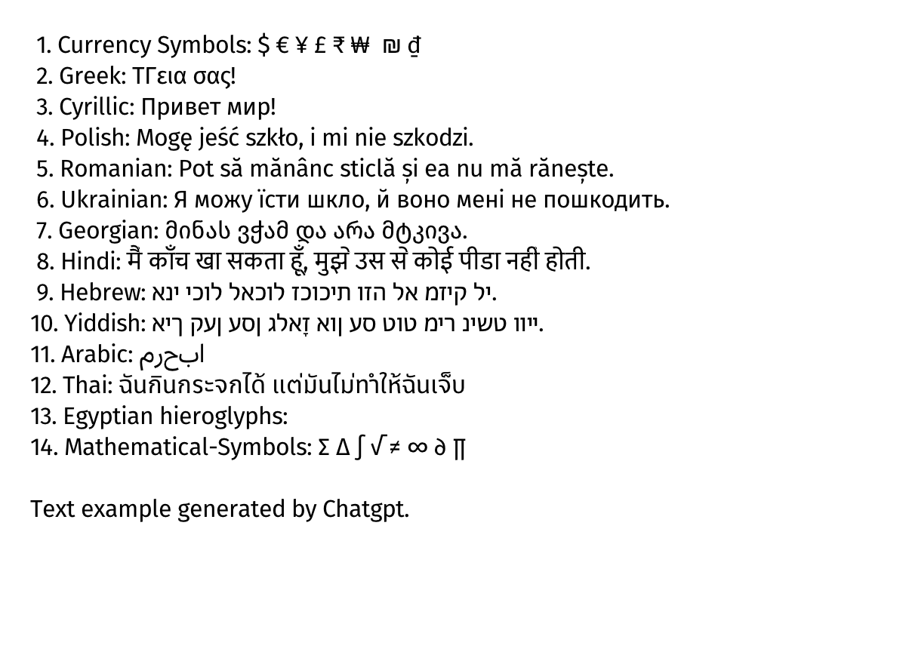

# JFont
JFont is a lightweight TrueType font parsing & rendering library for Java, designed for simplicity and efficiency. With its single-file implementation, JFont provides developers with an easy-to-use solution.

## Features
- **Unicode support**: Ensures compatibility with a wide range of characters.
- **Small footprint**: Minimalistic design with no external dependencies other than standard libraries.
- **Supported formats**: TrueType (.ttf) and certain OpenType (.otf) fonts.
- **Maintain security**: by avoiding crashes, memory leaks, and vulnerabilities.


## TODO
- [ ] Add support for left-to-right text rendering
- [ ] Implement support for colored text rendering
- [ ] Integrate emoji rendering functionality
- [ ] Add/Enhance the quality of the demo
- [ ] Conduct additional testing to ensure reliability and performance

## Example
A screenshot of the demo program:

<br><br>

# DOCUMENTATION

## Functions
This code provides functions to load, process, and render font data. The main functionalities include loading font files, identifying glyphs from character codes, calculating glyph metrics, rendering a glyphs to bitmap, and decoding font outlines.

### 1. `loadFont`

```java
public static Font loadFont(String filepath) {
```

#### Description
Loads a font from the specified file path.

#### Parameters
- `filepath`: The path to the font file.

#### Returns
- `Font`: An object representing the loaded font, or `null` if the font cannot be loaded.

### 2. `glyph_id`

```java
public static int glyph_id(Font font, int charCode, int[] gid)
```

#### Description
Gets the glyph ID for a given character code.

#### Parameters
- `font`: The font from which to get the glyph.
- `charCode`: The character code to look up.
- `gid`: An array to store the resulting glyph ID.

#### Returns
- `int`: `0` on success, `-1` on failure.

### 3. `gmetrics`

```java
public static int gmetrics(JF jf, int[] gid, GMetrics metrics)
```

#### Description
Calculates the metrics for a given glyph.

#### Parameters
- `jf`: An `JF` object containing the font and transformation data.
- `gid`: An array containing the glyph ID.
- `metrics`: An `GMetrics` object to store the calculated metrics.

#### Returns
- `int`: `0` on success, `-1` on failure.

### 4. `sftrender`

```java
public static int renderfont(JF jf, int glyph, Image image)
```

#### Description
Renders a glyph into a bitmap image.

#### Parameters
  - `jf`: An `JF` object containing the font and transformation data.
- `glyph`: The glyph ID to render.
- `image`: An `Image` object to store the rendered image.

#### Returns
- `int`: `0` on success, `-1` on failure.


### 5. `decodeoutline`

```java
public static int decodeoutline(Font font, int offset, int recDepth, Outline outl)
```

#### Description
Decodes the outline of a glyph.

#### Parameters
- `font`: The font to process.
- `offset`: The offset to the outline data.
- `recDepth`: The recursion depth (used for compound glyphs).
- `outl`: An `Outline` object to store the decoded outline.

#### Returns
- `int`: `0` on success, `-1` on failure.


<br><br>
## Data Structures

### 1. `JF`

#### Description
Represents the font transformation data.

#### Fields
- `font`: The font object.
- `xScale`: The scale factor in the x direction.
- `yScale`: The scale factor in the y direction.
- `xOffset`: The xoffset.
- `yOffset`: The y offset.
  
### 2. `Font`

#### Description
Represents a font.

#### Fields
- `memory`: The byte array of the font data.
- `size`: The size of the font data.
- `unitsPerEm`: Units per em value of the font.
- `locaFormat`: The loca format of the font.
- `numLongHmtx`: Number of long horizontal metrics.

### 3. `Image`

#### Description
Represents an image of a rendered glyph.

#### Fields
- `pixels`: The array of pixel data.
- `width`: The width of the image.
- `height`: The height of the image.

### 4. `GMetrics`

#### Description
Represents the metrics of a glyph.

#### Fields
- `minX`: Minimum x coordinate.
- `minY`: Minimum y coordinate.
- `maxX`: Maximum x coordinate.
- `maxY`: Maximum y coordinate.
- `advanceWidth`: The advance width of the glyph.
- `leftSideBearing`: The left side bearing of the glyph.


### 5. `Outline`

#### Description
Represents the outline of a glyph.

#### Fields
- `numContours`: Number of contours in the glyph.
- `endPtsOfContours`: Array of end points of contours.
- `numPoints`: Number of points in the glyph.
- `flags`: Array of flags.
- `points`: Array of points.
- `curves`: Array of curves.
- `lines`: Array of lines.

### 6. `Point`

#### Description
Represents a point in a glyph outline.

#### Fields
- `x`: The x coordinate of the point.
- `y`: The y coordinate of the point.

### 7. `Raster`

#### Description
Represents a raster buffer for drawing.

#### Fields
- `pixels`: The array of pixel data.
- `width`: The width of the raster buffer.
- `height`: The height of the raster buffer.
